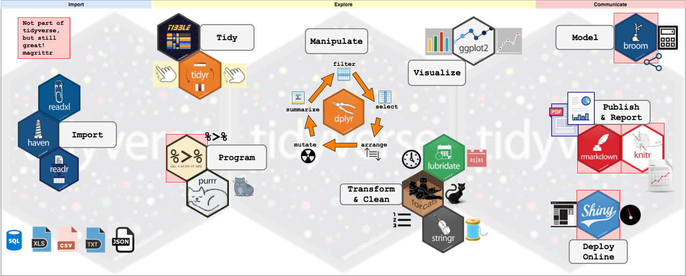
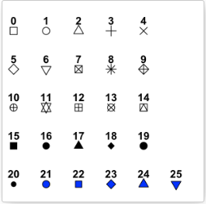

<style type="text/css">

body{ /* Normal  */
      font-size: 12px;
  }
td {  /* Table  */
  font-size: 12px;
}
h1.title {
  font-size: 38px;
  color: lightblue;
  font-weight: bold;
}
h1 { /* Header 1 */
  font-size: 24px;
  color: DarkBlue;
}
h2 { /* Header 2 */
  font-size: 20px;
  color: DarkBlue;
}
h3 { /* Header 3 */
  font-size: 16px;
#  font-family: "Times New Roman", Times, serif;
  color: DarkBlue;
}
h4 { /* Header 4 */
  font-size: 14px;
  color: DarkBlue;
}
code.r{ /* Code block */
    font-size: 12px;
}
pre { /* Code block - determines code spacing between lines */
    font-size: 12px;
}
</style>


```{r setup, include=FALSE}
#knitr::opts_chunk$set(echo = TRUE)
knitr::opts_chunk$set(echo=TRUE, fig.height=3.5, fig.width=9.2, results='hold', warning=FALSE, fig.show='hold', message=FALSE) 
options(scipen = 99)
```


# Objektif

Ini adalah catatan untuk memandu secara singkat dalam melakukan visualisasi data untuk kebutuhan eksplorasi data atau publikasi menggunakan R dan package `ggplot2`. Tujuan dari tutorial ini adalah agar peserta dapat mencoba membuat grafik yang menarik dan mudah. 

# Cakupan Materi
Materi yang akan dibahas:

+ Dasar-dasar ggplot2
+ Penggunaan fungsi `qplot()`
+ Aesthetic pada ggplot2
+ Barplot
+ Histogram & Density
+ Boxplot
+ Scatter plot
+ Line plot
+ Menentukan warna
+ Faceting
+ Annotation
+ Tema (`theme`)

# Prasyarat

Untuk dapat mengikuti tutorial ini dengan baik, ada beberapa hal yang perlu dipersiapkan, yaitu:

1. Koneksi internet yang baik

2. Menginstall software

    a. R program <https://cran.r-project.org/>

    b. RStudio <https://www.rstudio.com/products/rstudio/download/>

3. Data & Script yang dapat diperoleh dari [repository ini](https://github.com/aephidayatuloh/eksplorasi-data) dan pada database yang disediakan pembicara.

4. Package R yang dibutuhkan: `ggplot2`, `dplyr` (atau `tidyverse`) dan `nycflights13`.

Catatan: Data diperoleh dari packages `nycflights13` yang disimpan ke dalam database. Jika Anda ingin mencoba diluar kegiatan atau tidak dapat terhubung dengan database pembicara, Anda dapat menginstall package `nycflights13` untuk memperoleh data yang digunakan pada database. Dua data lain berupa file CSV untuk disesuaikan dengan kebutuhan tutorial. 

Data ini terdiri dari 336,776 penerbangan dari New York City (NYC) selama tahun 2013. Data asli berasal dari US Bureau of Transportation Statistics, dan dapat dilihat dokumentasinya dengan `?nycflights13::flights`.
Pastikan Anda sudah berhasil install package tersebut.

# Install dan Load Packages

Jalankan perintah di bawah ini untuk install package (**jika Anda belum pernah install**) yang akan digunakan untuk dapat mengikuti tutorial ini sampai selesai.

```{r eval=FALSE}
install.packages(c("ggplot2", "dplyr", "tidyr", "nycflights13"))
# atau                                                                         
install.packages(c("tidyverse", "nycflights13"))                         
```

Panggil package yang sudah Anda install dengan fungsi `library()`.

```{r loadpkg}
# Panggil package yang sudah terinstall
library(ggplot2)
library(dplyr)
library(tidyr)

# # atau cukup memanggil `tidyverse` untuk memanggil package ggplot2 dan package lain di tidyverse
# library(tidyverse)

library(nycflights13)
```

Package `ggplot2` (dan beberapa package lain yang tidak digunakan di tutorial ini) termasuk dalam bagian package `tidyverse`. `tidyverse` adalah kumpulan package yang dibuat oleh **Hadley Wickham** dkk untuk kebutuhan data science menggunakan R.

+ `ggplot2` adalah salah satu package yang sangat banyak digunakan oleh pengguna R untuk kebutuhan visualisasi.
+ `dplyr` dan `tidyr` adalah package yang sangat berguna untuk melakukan manipulasi/transformasi data menggunakan R.
+ `nycflights13` adalah package yang menyediakan 5 data frame dalam format [tibble](https://r4ds.had.co.nz/tibble.html) tentang penerbangan di NYC selama tahun 2013.

<p align="center">
    
    <br/>
    <br/>
    <em>Tidyverse</em>
</p>

`tidyverse` menggunakan **tibble** sebagai pengganti `data.frame`. 

> Tibbles are data frames, but they tweak some older behaviours to make life a little easier. R is an old language, and some things that were useful 10 or 20 years ago now get in your way. It’s difficult to change base R without breaking existing code, so most innovation occurs in packages -- [Grolemund & Wickham](https://r4ds.had.co.nz). 

## Operator Pipe `%>%`

Sebelum melangkah lebih jauh, kita harus mengeksploitasi operator pipe yang diimpor dari package `magrittr` oleh Stefan Bache. Ini akan mengubah kehidupan analitik data Anda. Anda tidak perlu lagi memberlakukan perintah multi-operasi dengan menyatukannya di dalam satu sama lain. Sintaks baru ini mengarah ke kode yang lebih mudah untuk ditulis dan dibaca.

Begini tampilannya: `%>%`. Pintasan keyboard RStudio: `Ctrl + Shift + M` (Windows), `Cmd + Shift + M` (Mac). Lebih lanjut mengenai operator `%>%` silahkan baca [penjelasan operator pipe](http://rpubs.com/aephidayatuloh/pipes).

# Eksplorasi dan Visualisasi Data

Kita lihat terlebih dulu data yang akan kita gunakan. Data yang akan digunakan ada 3, yaitu `flights`, `airlines` dan `weather`.

```{r headfl}
flights
```

Ada 336,776 jadwal penerbangan selama tahun 2013. Variabel `dep_delay` dengan nilai positif (`dep_delay > 0`) menunjukkan bahwa penerbangan tersebut mengalami keterlambatan dari jadwal berangkat yang seharusnya, sedangkan `dep_delay` negatif (`dep_delay < 0`) menunjukkan penerbanga dilakukan lebih awal dari yang seharusnya, dalam satuan menit. Adapun `dep_delay` yang `NA` (kosong atau missing value) menunjukkan penerbangan dibatalkan atau cancel.

```{r headairlines}
airlines
```

Di data ini terdapat 16 perusahaan maskapai penerbangan. Variabel `carrier` nantinya digunakan untuk di-join dengan variabel `carrier` juga pada data `flights`.

```{r headweather}
weather
```

Data di atas adalah data cuaca berdasarkan bandara yang ada pada varibel `origin` selama tahun 2013 dengan rentang waktu setiap satu jam (lihat `time_hour`). 

Sekarang kita lihat dulu secara sekilas seperti apa data `flights` yang akan kita gunakan.

```{r strfl}
str(flights)
```


```{r summaryfl}
summary(flights)
```

Dari hasil di atas saja sudah banyak hal yang kita dapatkan. Pertama, isi dari variabel `year` semuanya adalah `2013`. Tidak ada nilai lain selain itu. Variabel seperti ini biasanya akan langsung dibuang karena tidak mempunyai informasi yang dapat digunakan untuk analisis. Atau digunakan untuk membuat variabel baru. Misalnya dengan menggabungkan variabel `year`, `month` dan `day` menjadi sebuah variabel tanggal.

Kedua, pada variabel `dep_time`, `dep_delay`, `arr_time`, `arr_delay` dan `air_time` terdapat beberapa data yang nilainya `NA`. Artinya ada data penerbangan yang tidak memiliki data-data tersebut. Perlu diketahui dulu penyebab dan konteks data tersebut `NA`. Misalnya, jika suatu penerbangan tidak memiliki data `dep_time` artinya penerbangan tersebut tidak mempunyai catatan waktu *take-off*. Bisa jadi penerbangan tersebut di-*cancel*. Jika suatu penerbangan mempunyai data `dep_time` tapi tidak memiliki data `arr_time` maka bisa jadi penerbangan tersebut mengalami kecelakaan atau hal lainnya.

Siapkan data yang akan digunakan. Kita join data `flights` dengan `airlines` untuk mendapatkan variabel nama perusahaan maskapai penerbangan (`name`), kemudian join lagi dengan `weather` untuk mendapatkan data cuaca.

```{r}
flights_tbl <- flights %>% 
  left_join(airlines, by = "carrier") %>% 
  left_join(weather, suffix = c("_flight", "_weather"))
```

Untuk lebih mengetahui mengenai join menggunakan `dplyr` silahkan baca artikel [ini](https://dplyr.tidyverse.org/reference/join.html) dan [ini](https://r4ds.had.co.nz/relational-data.html).

```{r}
str(flights_tbl)
```

# Dasar-dasar ggplot2

Package `ggplot2` merupakan salah satu package untuk visualisasi yang paling banyak digunakan oleh pengguna R. Package ini juga yang menjadikan salah satu keutamaan R dibanding software pemrograman dan analisis data yang lain.

`ggplot2` didesain untuk bekerja secara iteratif. Kata `ggplot` sendiri merupaka kependekan dari [**grammar of graphics plot**](). Terdapat dua fungsi utama yang digunakan untuk visualisasi data. Fungsi `qplot()`, yang merupakan kependekan dari *quick-plot*. Penggunaan `qplot()` sendiri tidak terlalu banyak, bahkan pembuatnya sendiri mengatakan bahwa `qplot()` dibuat untuk mereka yang memang sudah sangat terbiasa menggunakan fungsi `plot()` pada base R. 

Fungsi kedua, dan yang paling sering digunakan, adalah `ggplot()`. Perbedaan yang paling mencolok dari fungsi `qplot()` dan `ggplot()` adalah tipe data yang dapat digunakan. Fungsi `qplot()` dapat menggunakan vector atau dataframe, sedangkan `ggplot()`hanya menerima dataframe. Fungsi-fungsi pada `ggplot2` berperan sebagai layer yang ditandai dengan `+`. 

Berikut contoh dari penggunaan `qplot()`. 

```{r}
not_cancel <- flights_tbl %>% 
  filter(!is.na(dep_delay))
```

```{r}
qplot(x = name, data = not_cancel)
```

Tentu saja tampilan grafik seperti di atas tidak baik karena informasi yang diberikan kurang sempurna. Nama maskapai penerbangan yang saling tumpang tindih juga membuat grafik tersebut tidak menarik.

```{r}
qplot(x = name, data = not_cancel) +
  theme(axis.text.x = element_text(angle = 90))
```

Fungsi `theme()` akan diabhas lebih banyak di bagian berikutnya.

# Visualisasi dengan ggplot()

Fungsi yang paling sering digunakan dari package `ggplot2` adalah `ggplot()`. Secara umum visualisasi menggunakan `ggplot()` adalah seperti berikut.

```{r ggplot, eval=FALSE}
ggplot(data = <DATA>, mapping = aes(x = <VAR>, y = <VAR>)) + 
  <GEOM_FUNCTION>()
```

Anda dapat mempelajari tentang `ggplot2` dari buku *ggplot2 Elegant Graphics for Data Analysis second edition*.


## Barplot

Yang pertama kita akan melakukan eksplorasi data dengan menggunakan diagram batang atau barplot. Grafik yang akan dihasilkan sama dengan yang dihasilkan oleh `qplot()` sebelumnya.

```{r bar1}
ggplot(data = not_cancel, mapping = aes(x = name)) +
    geom_bar() +
    theme(axis.text.x = element_text(angle = 90))
```

Geom `geom_bar()` dapat menerima data dengan format memanjang (raw) atau tabulasi.

```{r}
not_cancel %>% 
  select(name)
```

Jika bentuk datanya memanjang seperti ini maka cukup menyebutkan variabelnya di argumen `x = ` pada `aes()`.

```{r}
ggplot(data = not_cancel, mapping = aes(x = name)) +
    geom_bar() +
    theme(axis.text.x = element_text(angle = 90))
```

Jika datanya dalam bentuk tabulasi, sebutkan kategorinya di argumen `x = ` dan nilainya di argumen `y = `, kemudian tambahkan `stat = "identity"` pada `geom_bar()`.

```{r}
not_cancel <- not_cancel %>% 
  count(name) 
not_cancel
```

```{r}
ggplot(data = not_cancel, mapping = aes(x = name, y = n)) +
  geom_bar(stat = "identity") +
  theme(axis.text.x = element_text(angle = 90))
```

Secara `default` tampilan barplot diurutkan berdasarkan alfabet kategori pada argumen `x`. Jika ingin barplot diurutkan berdasarkan nilainya, gunakan fungsi `reorder()`.

```{r}
ggplot(data = not_cancel, mapping = aes(x = reorder(name, -n), y = n)) +
  geom_bar(stat = "identity") +
  theme(axis.text.x = element_text(angle = 90))
```

Untuk mengurutkan barplot berdasarkan value

 1. Buat terlebih dahulu tabel frekuensi dari kategori yang diinginkan.
 2. gunakan fungsi reorder() pada aestethic `x` dan n sbg `y`.
 3. gunakan `stat = "identity"` pada `geom_bar()`.

```{r}
not_cancel <- not_cancel %>% 
  mutate(pct = n/sum(n))

ggplot(data = not_cancel, mapping = aes(x = reorder(name, -pct), y = pct)) +
  geom_bar(stat = "identity") +
  theme(axis.text.x = element_text(angle = 90))
```

```{r}
canceled <- flights_tbl %>% 
  filter(is.na(dep_delay)) %>% 
  count(name) %>% 
  mutate(pct = n/sum(n))
canceled
```

Dari tabel di atas kita dapat mengetahui bahwa ExpressJet Airlines Inc. yang paling banyak melakukan cancel selama tahun 2013. Sekarang mari kita tampilkan dalam visualisasi.

```{r}
g <- ggplot(data = canceled, mapping = aes(x = reorder(name, -pct), y = pct)) +
  geom_bar(stat = "identity") +
  theme(axis.text.x = element_text(angle = 90))

g
```

```{r}
g +
  labs(title = "Persentase Maskapai Yang Sering Melakukan Cancel",
       x = "Maskapai",
       y = "Persentase") +
  theme(axis.title.y = element_text(angle = 0, vjust = 1))
```

Hasil dari `ggplot` dapat disimpan dalam sebuah objek di R kemudian ditambahkan layer dengan `+` dan `geom` atau komponen lain.

Kita juga dapat menentukan warna untuk masing-masing batang pada barplot. Misalnya, setiap batang berbeda warnanya berdasarkan nama kategorinya secara default.

Untuk menambahkan judul (`title`), mengganti judul masing-masing axis `x` dan `y` atau menambahkan `subtitle`dapat menggunakan `labs()`.

```{r}
ggplot(data = canceled, mapping = aes(x = reorder(name, -pct), y = pct, fill = name)) +
  geom_bar(stat = "identity") +
  theme(axis.text.x = element_text(angle = 90),
        axis.title.y = element_text(angle = 0, vjust = 1),
        legend.position = "none") +
  labs(title = "Persentase Maskapai Yang Sering Melakukan Cancel",
       x = "Maskapai",
       y = "Persentase")
```

Argumen `legend.position = "none"` digunakan untuk menghilangkan legend dari grafik yang dibuat. Cobalah untuk menghapus argumen `legend.position = "none"` dan lihat hasilnya.

```{r fig.height=6}
ggplot(data = canceled, mapping = aes(x = reorder(name, -pct), y = pct*100, fill = name)) +
  geom_bar(stat = "identity") +
  geom_text(aes(label = paste(round(pct*100, 2), "%")), vjust = -0.25) +
  theme(axis.text.x = element_text(angle = 90),
        axis.title.y = element_text(angle = 0, vjust = 1),
        legend.position = "none") +
  labs(title = "Persentase Maskapai Yang Sering Melakukan Cancel",
       x = "Maskapai",
       y = "Persentase")
```

Anda juga dapat melakukan operasi matematika sederhana untuk variabel yang akan digunakan. Misalnya mengubah satuan `pct` dengan dikalikan 100. `geom_text()` digunakan untuk menambahkan komponen layer teks pada grafik. Dalam kasus ini digunakan untuk menampilkan nilai di atas masing-masing batang. `vjust = -0.25` agar teks berada di atas batang.

```{r fig.width = 16, fig.height=10}
ggplot(data = canceled, mapping = aes(x = reorder(name, pct), y = pct*100, fill = name)) +
  geom_bar(stat = "identity") +
  geom_text(aes(label = paste(round(pct*100, 2), "%")), hjust = -0.01) +
  theme(legend.position = "none") +
  labs(title = "Persentase Maskapai Yang Sering Melakukan Cancel",
       x = "Maskapai",
       y = "Persentase") +
  coord_flip()
```

Agar tampilan barplot dengan `axis.text.x` lebih menarik, gunakan `coord_flip()` untuk memutar grafik. Posisi axis `x` di posisi `y` dan sebaliknya.

## Histogram & Density

Histogram atau Density dapat digunakan untuk memvisualisasikan sebaran dari sebuah variabel numerik.


```{r}
g <- ggplot(data = flights_tbl, mapping = aes(x = air_time))
g
```

Karena variabel yang akan kita gunakan sama, yaitu hanya `air_time` maka kita simpan dahulu hasil dari ggplot ke dalam objek `g` sehingga kita dapat mengganti argumen pada `geom_histogram()` tanpa perlu memanggil lagi fungsi `ggplot()` dengan argumen yang sama sepertisebelumnya. Ketika kita panggil objek dari `ggplot` tersebut, maka hnaya menapilkan sebuah kanvas kosong karena kita belum menambahkan layer `geom` apa yang akan digunakan.

```{r}
g +
  geom_histogram()
```

Ketika kita tambahkan `geom_histogram()` maka akan ditambahkan histogram. Secara default `geom_histogram()` menggunakan 30 bins. `bins` adalah banyaknya kotak/batang, sedangkan lebar batang disebut `binwidth`. Jika ada `NA` maka secara otomatis akan dibuang.

```{r}
g +
  geom_histogram(bins = 50, fill = "skyblue", color = "white")
```

Dengan `bins = 50` artinya pada histogram tersebut akan digunakan 50 batang. Argumen `fill = "skyblue"` untuk memberikan warna pada batang histogram. Anda juga dapat menggunakan warna lain, misalnya `fill = "pink"` atau `fill = "lightblue"` atau bahkan menggunakan [kode warna Hex](https://www.google.com/search?safe=strict&ei=GS71XN26L5rXz7sPp9ulwAw&q=%23ffffff&oq=%23ffffff&gs_l=psy-ab.3...5224.5224..5824...0.0..0.251.251.2-1......0....1..gws-wiz.......0i71.83viXprUXa8).

Sebagian besar lamanya penerbangan kurang dari 200 menit. Namun dari grafik di atas terlihat ada beberapa puncak yang terjadi. Mari kita lihat menggunakan `geom_density()` 

```{r}
g +
  geom_histogram(aes(y = ..density..), bins = 50, fill = "skyblue", color = "white") +
  geom_density(color = "darkgreen", size = 0.7)
```

```{r}
g +
  geom_density(fill = "skyblue", alpha = 0.5)
```

Namun jika diperhatikan, ada juga penerbangan yang lama waktu terbangnya lebih dari 600 menit atau 10 jam. Kita lihat data dengan penerbangan selama sekitar 10 jam tersebut.

```{r}
flights10h <- flights_tbl %>% 
  filter(air_time > 500)

flights10h %>% 
  group_by(origin, dest) %>% 
  summarise(min = min(air_time), avg = mean(air_time), std = sd(air_time), max = max(air_time))
```

Ternyata penerbangan dari bandara `EWR` dan `JFK` menuju bandara `HNL` rata-rata membutuhkan waktu terbang lebih dari 600 menit atau 10 jam. Apa itu `HNL`?

```{r}
airports %>% 
  filter(faa == "HNL")
```


## Boxplot

Secara default, boxplot di `ggplot2` memerlukan variabel kategorik sebagai argumen `x` dan variabel numerik sebagai argumen `y`.

```{r}
ggplot(data = flights_tbl, mapping = aes(x = name, y = wind_speed)) +
  geom_boxplot() +
  coord_flip()
```

Jika hanya ingin satu boxplot untuk satu variabel tanpa dibedakan berdasarkan kategori lain maka cukup gunakan `x = ''` atau string lain seperti contoh berikut.

```{r}
ggplot(data = flights_tbl, mapping = aes(x = "Statistics", y = temp)) +
  geom_boxplot()
```

```{r}
ggplot(data = flights_tbl, mapping = aes(x = origin, y = temp)) +
  geom_boxplot() +
  coord_flip()
```

```{r}
ggplot(data = flights_tbl, mapping = aes(x = origin, y = temp)) +
  geom_boxplot(color = "skyblue") +
  coord_flip()
```

Anda dapat membaca beberapa artikel tentang `geom_boxplot()`, salah satunya [geom_boxplot](https://ggplot2.tidyverse.org/reference/geom_boxplot.html).


## Scatter plot

Scatter plot adalah visualisasi data dari dua buah variabel numerik. Misalkan dari data `weather` kita ambil data cuaca di bandara `JFK` saja selama tahun 2013.

```{r}
weather_jfk <- weather %>% 
  filter(origin == "JFK") 
```

```{r}
ggplot(data = weather_jfk, mapping = aes(x = time_hour, y = temp)) + 
  geom_point()
```

Anda dapat merubah `shape` dari `geom_point` dengan sebuah bilangan integer.

<p align="center">
    
    <br/>
    <br/>
    <em>Point Shape</em>
</p>


```{r}
ggplot(data = weather_jfk, mapping = aes(x = time_hour, y = temp)) + 
  geom_point(shape = 1) +
  labs(title = "Suhu Bandara JFK Selama Tahun 2013",
       x = "waktu",
       y = "Suhu")
```

## Line plot/time series plot

```{r}
ggplot(data = weather_jfk, mapping = aes(x = time_hour, y = temp)) + 
  geom_line()
```

```{r}
ggplot(data = weather_jfk, mapping = aes(x = time_hour)) + 
  geom_line(aes(y = temp), color = "skyblue")
```

Ketebalan garis dapat disesuaikan dengan `size =`, misalnya `size = 1` untuk garis yang lebih tebal dari default. 

```{r}
ggplot(data = weather_jfk, mapping = aes(x = time_hour, y = temp)) + 
  geom_line(color = "skyblue") +
  geom_point(size = 0.5) +
  scale_x_datetime(breaks = "1 month", date_labels = "%b %d") +
  theme(axis.text.x = element_text(angle = 90))
```

```{r}
ggplot(data = weather_jfk, mapping = aes(x = time_hour, y = temp)) + 
  geom_line() +
  geom_point(size = 0.5) +
  scale_x_datetime(breaks = "days", date_labels = "%b %d") +
  theme(axis.text.x = element_text(angle = 90))
```

```{r}
ggplot(data = weather_jfk, mapping = aes(x = time_hour, y = temp)) + 
  geom_line() +
  geom_point(size = 0.5) +
  scale_x_datetime(breaks = "1 month", date_labels = "%b %d") +
  theme(axis.text.x = element_text(angle = 90)) +
  labs(title = "Suhu Bandara JFK Selama Tahun 2013",
       x = "Waktu",
       y = "Suhu")
```


```{r}
weather_jfk %>% 
  ggplot(mapping = aes(x = time_hour, y = temp)) +
  geom_line() +
  geom_smooth()
```

```{r}
weather %>% 
  ggplot(mapping = aes(x = time_hour, y = temp, color = origin)) +
  # geom_line() +
  geom_smooth() +
  scale_color_manual(values = c("#ea5454", "#6f45d8", "#57c158"))
```

# Facet

```{r}
flights_aug2 <- flights_tbl %>% 
  inner_join(airports, by = c("origin" = "faa"), suffix = c("_carrier", "_originairports")) %>% 
  filter(!is.na(dep_delay) & month == 8) %>% 
  mutate(tgl = as.Date(paste(year, month, day, sep = "-"))) %>% 
  group_by(name_originairports, tgl) %>% 
  summarise(n = n()) 
```

```{r}
ggplot(data = flights_aug2, mapping = aes(x = tgl, y = n)) + 
  geom_line(color = "skyblue") +
  geom_point() +
  facet_grid(rows = vars(name_originairports)) +
  scale_x_date(breaks = "days", date_labels = "%d") +
  theme(axis.text.x = element_text(angle = 45)) +
  labs(title = "Jumlah Penerbangan Harian Bulan Agustus 2013",
       x = "Tanggal",
       y = "Jumlah")
```

```{r}
ggplot(data = flights_aug2, mapping = aes(x = tgl, y = n)) + 
  geom_line(color = "skyblue") +
  geom_point() +
  facet_grid(name_originairports ~ . ) +
  scale_x_date(breaks = "days", date_labels = "%d") +
  theme(axis.text.x = element_text(angle = 45)) +
  labs(title = "Jumlah Penerbangan Harian Bulan Agustus 2013",
       x = "Tanggal",
       y = "Jumlah")
```

```{r}

ggplot(data = flights_aug2, mapping = aes(x = tgl, y = n)) + 
  geom_line(color = "skyblue") +
  geom_point() +
  facet_grid(cols = vars(name_originairports)) +
  labs(title = "Jumlah Penerbangan Harian Bulan Agustus 2013",
       x = "Tanggal",
       y = "Jumlah")
```

```{r}

ggplot(data = flights_aug2, mapping = aes(x = tgl, y = n)) + 
  geom_line(color = "skyblue") +
  geom_point() +
  facet_grid( . ~ name_originairports) +
  labs(title = "Jumlah Penerbangan Harian Bulan Agustus 2013",
       x = "Tanggal",
       y = "Jumlah")
```

```{r}
ggplot(data = flights_aug2, mapping = aes(x = tgl, y = n)) + 
  geom_line(color = "skyblue") +
  geom_point() +
  facet_grid(rows = vars(), cols = vars(name_originairports)) +
  labs(title = "Jumlah Penerbangan Harian Bulan Agustus 2013",
       x = "Tanggal",
       y = "Jumlah")
```

Setelah selesai membuat grafik yang Anda inginkan, Anda dapat menyimpan grafik tersebut dengan fungsi `ggsave()`.

```{r ggsave}
g <- flights_tbl %>% 
  filter(origin == "JFK") %>% 
  ggplot(mapping = aes(x = time_hour, y = temp)) +
  geom_line() +
  geom_smooth()

ggsave(filename = "plotR.jpg", plot = g, width = 10, height = 7)
```

Jika Anda tidak menyebutkan objek `ggplot2` pada `plot =` maka secara otomatis plot yang terakhir dibuat yang akan dipilih.
